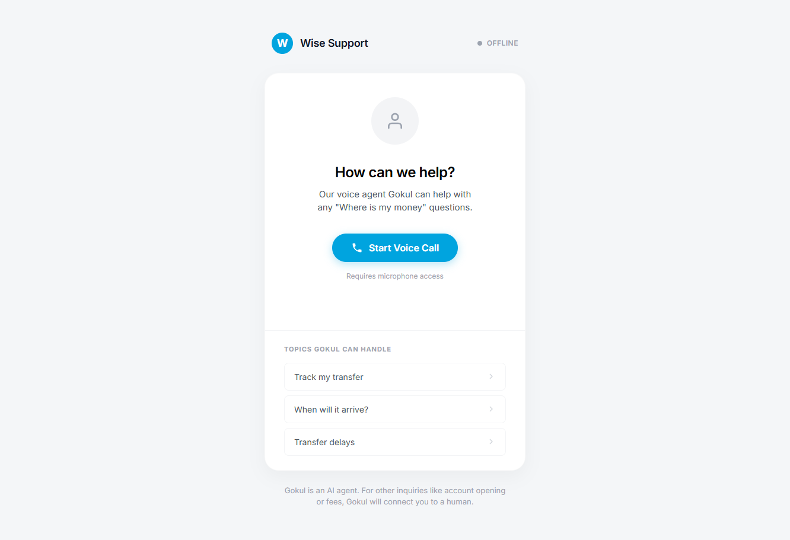
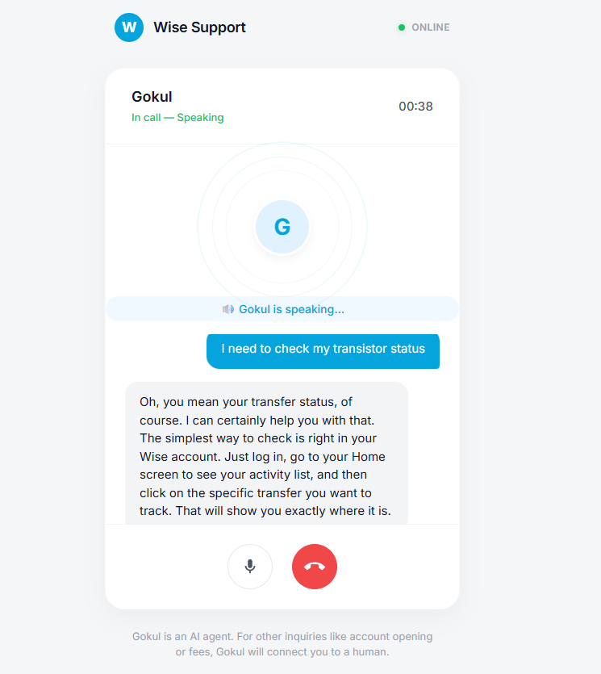
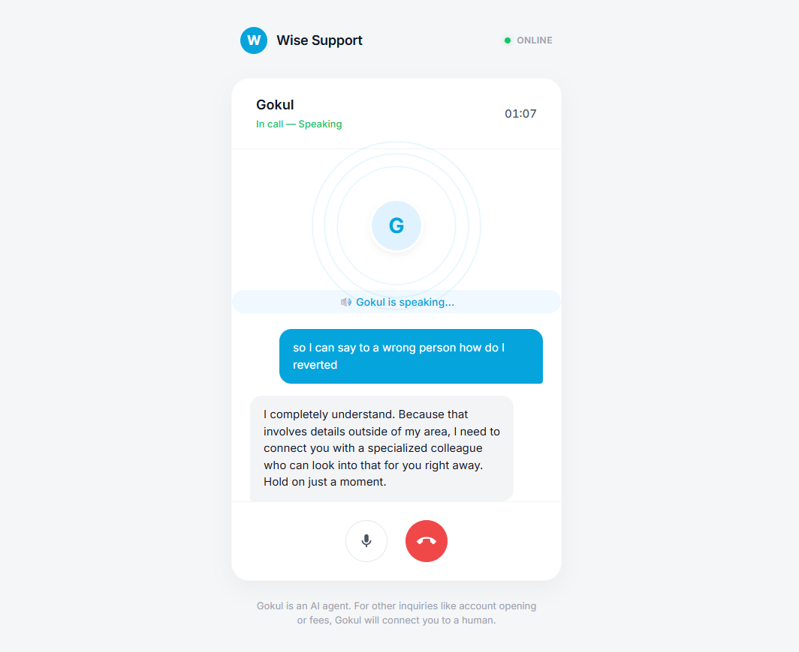
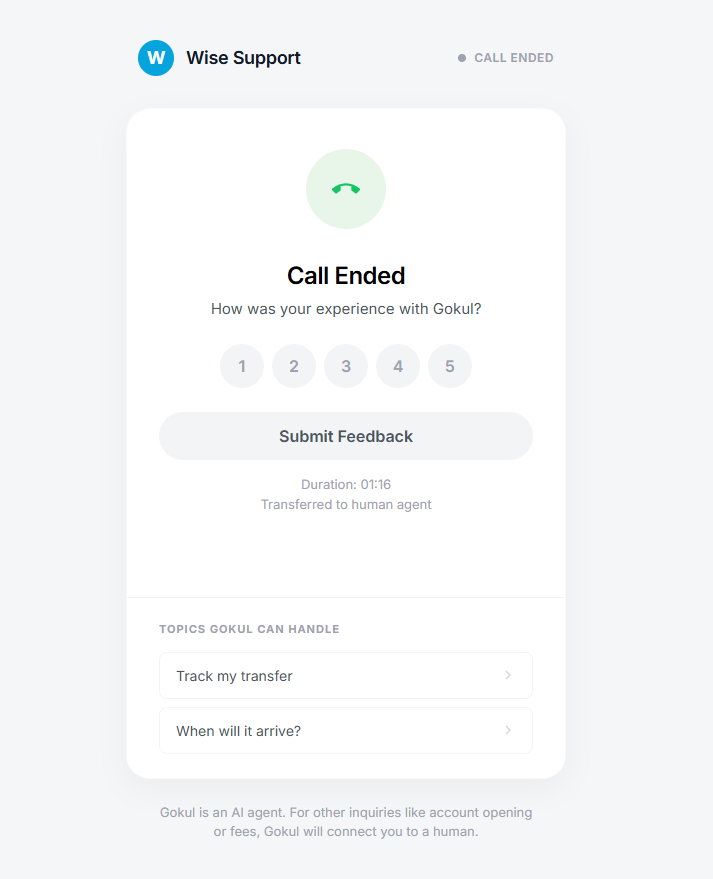

# Wise Voice Agent

A real-time, interruptible AI voice agent built to handle customer support inquiries for Wise (formerly TransferWise). The agent, "Gokul", acts as a calm, patient guide that strictly adheres to predefined FAQ knowledge to answer questions about money transfers.

## Features

* **Full-Duplex Conversation (Interruptible):** The microphone stays constantly hot. If you start speaking while the agent is talking, the agent instantly stops speaking, aborts the current thought process, and responds to your new input.
* **Ultra-Low Latency Streaming:** 
  * LLM responses are streamed via Server-Sent Events (SSE) from Google's Gemini 2.5 Flash model.
  * Audio is generated instantly using ElevenLabs and streamed natively to the browser in real-time.
* **Smart Free-Tier Fallback:** If ElevenLabs rejects the request (e.g., due to IP blocks on cloud servers like Railway on the Free Tier), the backend automatically and instantly intercepts the 401/403 error and falls back to **Microsoft edge-tts** (free, open-source) to ensure the call continues flawlessly.
* **Strict Scope Adherence:** The agent is heavily prompted to deflect out-of-scope inquiries (like account issues, refunds, or mistakes) to a human agent, relying solely on an injected JSON knowledge base.
* **Silence Detection:** Automatically prompts with a "Still there?" overlay after 20 seconds of silence to gracefully end inactive calls.
* **Professional Light Theme UI:** A clean, responsive design matching the Wise brand, featuring dynamic online/offline indicators, pulsing voice visualizers, and a post-call rating screen.

##  Screenshots

<div style="display: flex; flex-wrap: wrap; gap: 10px;">
  
  
  
  
</div>

## Tech Stack

* **Backend:** Python, FastAPI, Uvicorn, httpx
* **AI Model:** Google Gemini 2.5 Flash (`google-genai` SDK)
* **Text-to-Speech (TTS):** ElevenLabs API (Flash v2.5 model) with automatic fallback to `edge-tts` (Microsoft Edge Neural Voice)
* **Speech-to-Text (STT):** Browser-native Web Speech API
* **Frontend:** Vanilla HTML5, CSS3, JavaScript (Zero dependencies)

## Setup & Installation

1. **Clone the repository:**
   ```bash
   git clone <repository-url>
   cd wise-voice-agent
   ```

2. **Set up a virtual environment & install dependencies:**
   ```bash
   python -m venv .venv
   source .venv/bin/activate  # On Windows use: .venv\Scripts\activate
   pip install -r requirements.txt
   ```

3. **Configure Environment Variables:**
   Rename `.env.example` to `.env` and add your API keys:
   ```env
   GEMINI_API_KEY="your_google_gemini_api_key_here"
   ELEVENLABS_API_KEY="your_elevenlabs_api_key_here"
   ```

4. **Run the Application:**
   ```bash
   python server.py
   ```
   *The server will start on `http://127.0.0.1:8000`. Make sure you use a modern browser (Chrome/Edge) to ensure Web Speech API compatibility.*

## Knowledge Base Configuration

The agent's knowledge is driven by `faq_knowledge.json`. You can easily expand the agent's capabilities by adding new Q&A pairs to this file. The system prompt dynamically loads and injects this context to ground the LLM's responses, preventing hallucinations.

---

## ☁️ Deploying to Railway

This project is fully dockerized and ready to deploy on [Railway.app](https://railway.app) free of hassle.

1. Connect your GitHub repository to Railway.
2. Under the variable tab, add your **`GEMINI_API_KEY`** and **`ELEVENLABS_API_KEY`**.
3. *Optional but recommended:* Set a custom start command under Settings -> Deploy -> Custom Start Command: `uvicorn server:app --host 0.0.0.0 --port $PORT`
4. Generate a public domain in the Networking tab.

*Note: If you are on the ElevenLabs Free Tier, ElevenLabs blocks IP addresses belonging to cloud providers (like Railway) to prevent abuse. Our backend will automatically detect this and switch to the open source `edge-tts` voice.*